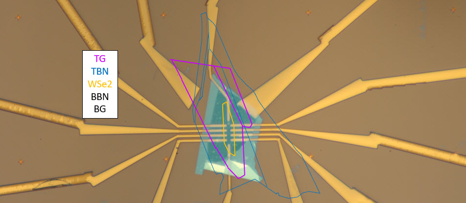
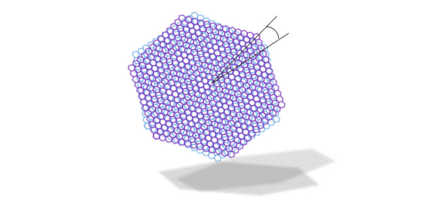
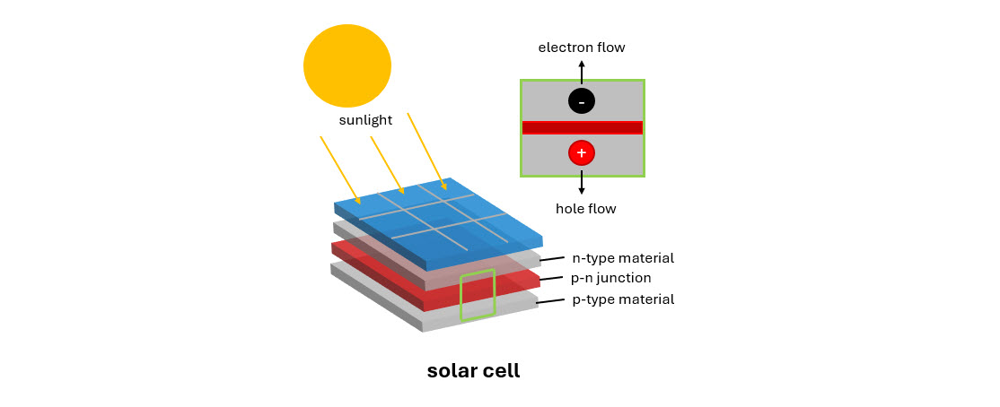
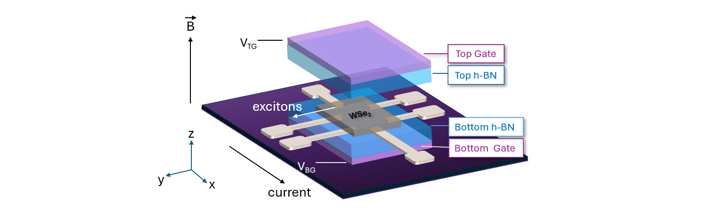

I am a researcher and an incoming PhD student at University of California, Riverside, holding a bachelors in Physics. 
  
<a href = "https://veecarling.github.io/assets/files/Vanessa_Kwong_CV.pdf" target = "_blank">
<button class="button-57" role="button">Please refer to my curriculum vitae hereCV</button>
</a>
  
I look forward to additional research involvement and higher education in condensed matter physics or materials science / engineering, and potentially patent law in the semiconductor industry. 

---

## Background ##
My first three years in university were spent towards a degree in biology on a pre-medicine route, aiming to work in forensic pathology. I was captivated by its problem-solving 
and research implementation into the field of medicine. This emphasized the importance of lawmaking, law compliance, and also giving respect back to those who have passed through using known evidence to uncover their cause of death and conviction of the guilty. 

By the beginning of my fourth year, I had found great interest in being on the forefront of research over clinical work. My great initial impression of introductory physics led me to take a course and starting research in condensed matter physics, studying processes and interactions at an atomic level---the very studies that can advance technology to solve problems in any field. I was fascinated by the vast impact studies on such small systems can have. Through initially declaring a minor in physics, I explored specific fields of physics through various upper-division courses and research, eventually switching to the major a quarter before my originally intended graduation term.

In my final years of my undergraduate degree, I have been working as an undergraduate researcher in experimental condensed matter at [**The Joe Lab**](https://joelab.ucr.edu/) under [**Dr. Andrew Joe**](https://profiles.ucr.edu/app/home/profile/ajoe) in the [**UC Riverside Department of Physics and Astronomy**](https://www.physics.ucr.edu/), focusing on transport and optical properties of two-dimensional materials within heterostructure devices.

---

## Interests ##
### *In Research...* ###
Continuing research dealing with two-dimensional materials is of interest, building onto my technical nanofabrication skills to test quality and efficiency in various semiconducting materials applicable to optoelectronics. Specifically I would like to investigate quantum states in novel materials such as transition metal dichalcogenides and their light-matter interaction through studying optics and transport. At the monolayer limit, these materials act as semiconductors capable of hosting correlated states, found at "magic angles". 

By creating a moiré pattern using twisted materials within a heterostructure device, light can interact differently with the resulting alignments (..or misalignments) of the original crystal structure. Successful experimentation with light and exciton activity in van der Waals materials at two dimensions opens the doors to large advancements in technology though its wide applications to optoelectronics development by discovering the properties and interactions of these materials.

In addition, my work as an undergraduate researcher and now building onto my progress as a post-grad researcher, focus on developing reliable low-temperature Ohmic contacts for TMDs such as p-type monolayer WSe2. There is a challenge for developing high-performing semiconductor field-effect transistors (FET), especially for p-type TMDS. This is caused by the Schottky barrier causing a mismatch at the 3D metal and 2D semiconductor interface. Therefore, we use high work function metal such as platinum to solve this issue, making reliable electrical contacts to eventually investigate Quantum Hall states in these materials. Initial tests consisted of measuring contact resistance and taking magnetotransport measurements for various monolayer TMD devices. I fabricate dual gated devices with h-BN-encapsulated monolayer TMDs using various nanofabrication techniques and equiptment including electron-beam lithography and evaporation with dry transfer of samples mechanically exfoliated from flux-grown bulk crystals. 

The application of a current with a perpendicular magnetic field applied to such devices cause negatively-charged electrons and positively-charged holes to separate, creating a charge potential. Carrier type and density can be extracted from these data. I aim to measure Hall resistance and observe Shubnikov-deHaas oscillations from the Quantum Hall effect. I would like to continue and expand on this project, studying transport and its efficiency in adjacent materials.

### *In Education and Advocacy...* ###
As with research in condensed matter physics, I aim to make large-scale contributions through studying and making changes at the small-scale. Reflecting on my learning curve and initial progress in a new area of study and research, to seeing the impactful projects of students I have trained, I have growing respect and appreciation for academia and research. In academia, mentorship plays a large role in the development of researchers, from principal investigator to graduate students, and from them to undergraduates. I believe effective undergraduate research begins with the right support and resources to help a student grow and push their potential. Not only does this gift each student with opportunity, but even broader, will effectively nurture the next generation of researchers, science, and implementation of these discoveries to the general public.

Especially prominent in experimental condensed matter, new information found through novel research takes decades to be engineered and fully applied to be carried out in practical uses. There is often confusion from starting researchers in the topic of how such concentrated subjects can be put to use in the everyday setting. This disconnection essentially hinders those unaware, who have not been brought up in an environment surrounded by such specific topics, from potential growth opportunities and discovery of academic or professional interests. I believe transparency and accessibility, combined with proactiveness of those willing to learn will shape researchers to become successful.

Through my experiences in research presentations and talks, I have made efforts to to simplify ideas and create visualisations for conventionally challenging concepts. I am deeply interested in growing to be able to explain scientific research to those in and out of this field, improving interdisciplinary research and scientific communication--for both researchers and the public.

### *At the Intersection of Research, Industry, Education, and Law...* ###
As a parallel with my initial interest in forensics, patent law gives respect to researchers who put in effort to pushing the forefront of science. I especially would like to concentrate on the semiconductor industry, where research is constantly driving discoveries in nanotechnology. Having laboratory experience with two-dimensional materials research in condensed matter physics applicable to optoelectronics, I understand the time and endeavours required in producing meaningful research. My personal background starting as a life sciences major and switching at the last minute---revisiting and building onto my introductory knowledge, and gathering adequate undergraduate experience in a new field in a little less than two years---has allowed me to understand the obstacles and steep learning curves that come with learning a new subject, especially one that is deemed conventionally unapproachable and complex.

