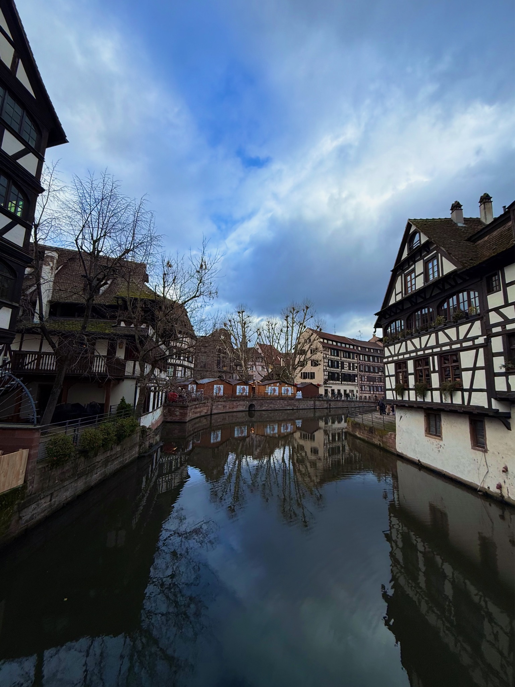
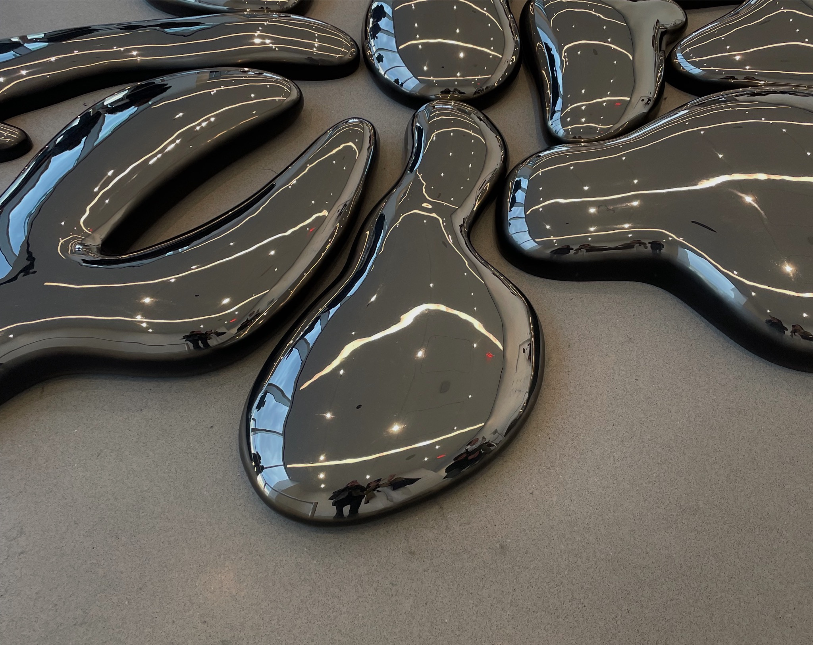
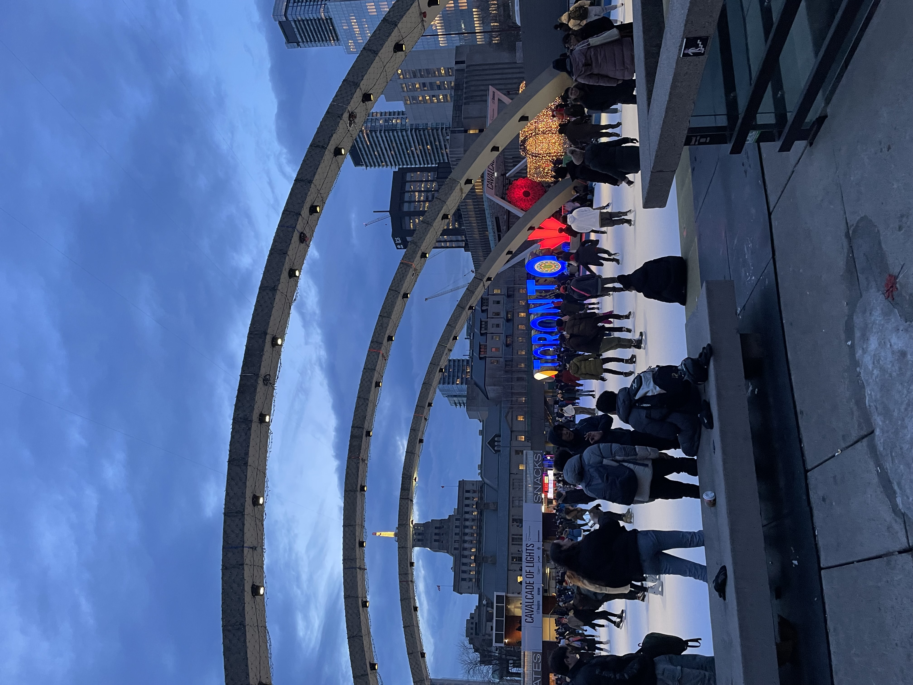
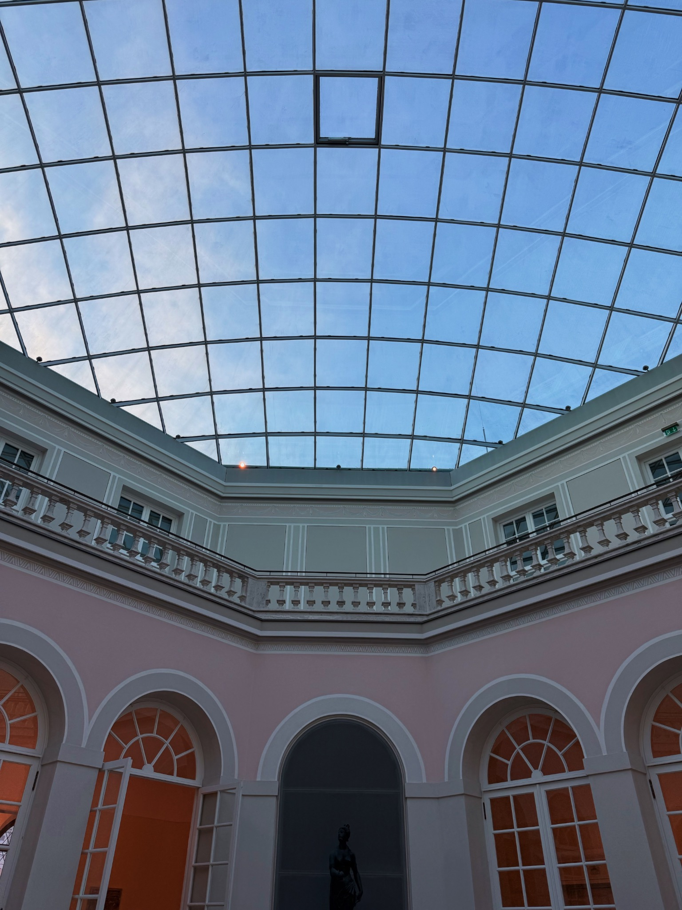
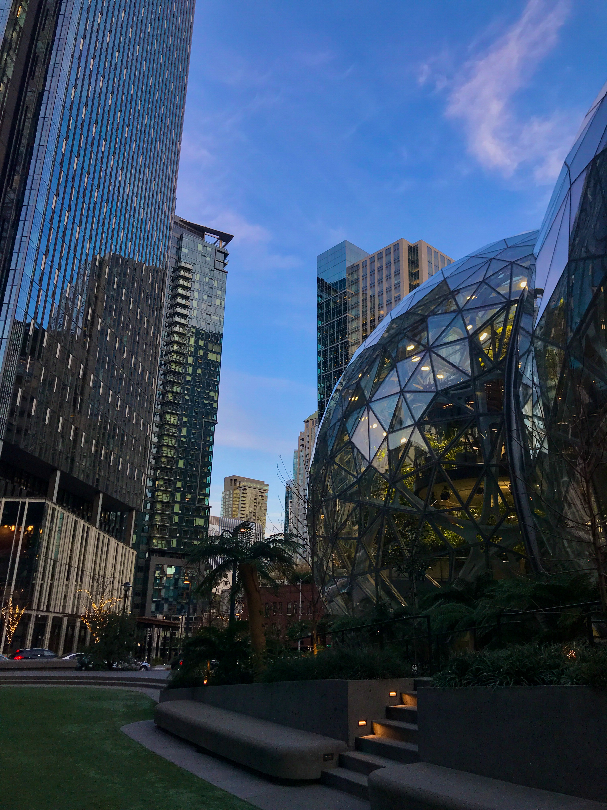
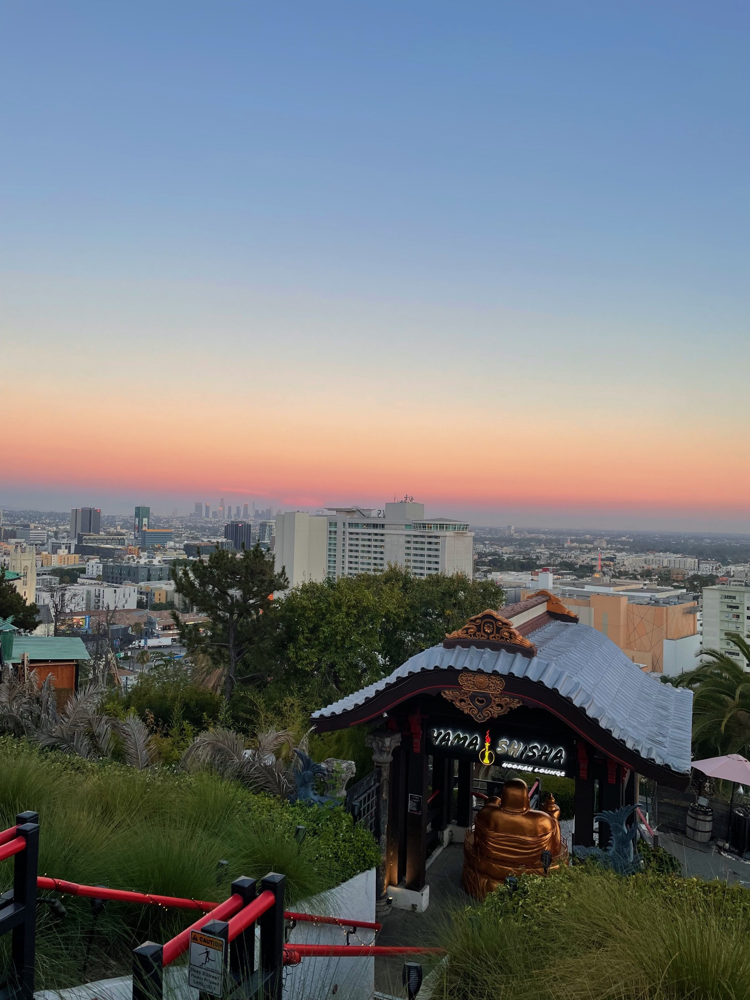

I am a fifth-year student and research assistant at University of California, Riverside, pursuing a bachelors in Physics. You can find my CV [**here**](assets/files/Vanessa_Kwong_CV.pdf).

Through extensive laboratory experience, I have become an adaptable and dedicated researcher, especially driven by my fascination and curiosity to understand and expand the novelty in science behind modern technological advancements. Pivoting from a biological science background and having trained starting lab members with differing backgrounds, I also have a desire to help in pushing the boundaries of multidisciplinary knowledge to bridge gaps between fields. I would like to help in overcoming conventionally steep learning curves through making research and its applications easily understandable and approachable, whether through meaningful mentorship, or merging art and science to model difficult concepts.
 
I look forward to additional research involvement and higher education in condensed matter physics or materials science / engineering, and potentially patent law. 

## Background ##
My first three years in university was spent towards a degree in biology on a pre-medicine route, aiming to work in forensic pathology. I was captivated by its problem-solving 
and research implementation into the field of medicine. By the beginning of my fourth year, I had found great interest in being on the forefront of research and studying processes 
and interactions at an atomic level--the very studies that can advance technology to solve problems in any field. I was fascinated by the vast impact studies on such small systems 
can have. Through initially declaring a minor in physics, I explored specific fields of physics through various upper-division courses and research, eventually switching to the major a quarter before my originally intended graduation term.

In my final years of my undergraduate degree, I have been working as an undergraduate researcher in experimental condensed matter at The Joe Lab under the UC Riverside Department of Physics and Astronomy, focusing on transport and optical properties of two-dimensional materials within heterostructure devices.

## Interests ##
### Research ###
Continuing research dealing with two-dimensional materials is of interest, building onto my technical nanofabrication skills to test quality and efficiency in various semiconducting materials applicable to optoelectronics.

### Education and Advocacy ###
As with research in condensed matter physics, I aim to make large-scale contributions through studying and making changes at the small-scale. Reflecting on my learning curve and initial progress in a new area of study and research, to seeing the impactful projects of students I have trained, I have growing respect and appreciation for academia and research. In academia, mentorship plays a large role in the development of researchers, from PI to graduate students, and from them to undergraduates. I believe effective undergraduate research begins with the right support and resources to help a student grow and push their potential. Not only does this gift each student with opportunity, but even broader, will effectively nurture the next generation of researchers, science, and implementation of these discoveries to the general public.

Especially prominent in experimental condensed matter, new information found through novel research takes decades to be engineered and fully applied to be carried out in practical uses. There is often confusion from starting researchers in the topic of how such concentrated subjects can be put to use in the everyday setting. This disconnection essentially hinders those unaware, who have not been brought up in an environment surrounded by such specific topics, from potential growth opportunities and discovery of academic or professional interests. I believe transparency and accessibility, combined with proactiveness of those willing to learn will shape researchers to become successful.

----
# Education #
### University of California, Riverside ###
**B.S. Physics**, *Expected April 2025*

---

##### Relevant Coursework:

###### Physics
> PHYS 111 : Astrophysics & Stellar Astronomy\
> PHYS 130A - 130B : Classical Mechanics\
> PHYS 135A - 135B : Electromagnetism\
> PHYS 136 : Electromagnetic Waves\
> PHYS 139L : Electronics Laboratory\
> PHYS 142W : Advanced Physics Laboratory\
> PHYS 150A - 150B : Introduction to Condensed Matter Physics\
> PHYS 156A - 156B : Quantum Mechanics\
> PHYS 177 : Computational Methods for Physical Sciences\
> PHYS 195A - 195C: Senior Thesis

###### Biological and Life Sciences
> BCH 100 : Introductory Biochemistry\
> BIOL 102: Genetics\
> BIOL 176 : Comparative Biomechanics\
> CBNS 101: Fundamentals of Cell Biology\
> CBNS 106 : Introduction to Neuroscience\
> CHEM 8A-C: Organic Chemistry

###### Other
> CS 10A : Computer Science for Science, Mathematics, and Engineering
 
---

In my free time, I enjoy travelling, [photography](https://vsco.co/veecarling/gallery), gaming, drawing, stand-up comedy, and exploring new cafes!

---

Petit France | Strasbourg, France

---

Summit One Vanderbilt | New York, USA

---

Nathan Phillips Square | Toronto, ON

---

The Residence | Munich, Germany

---

Causeway Bay Skyline | Hong Kong, HK

---

The Amazon Spheres | Seattle, USA

---

Yamashiro | Hollywood, USA
