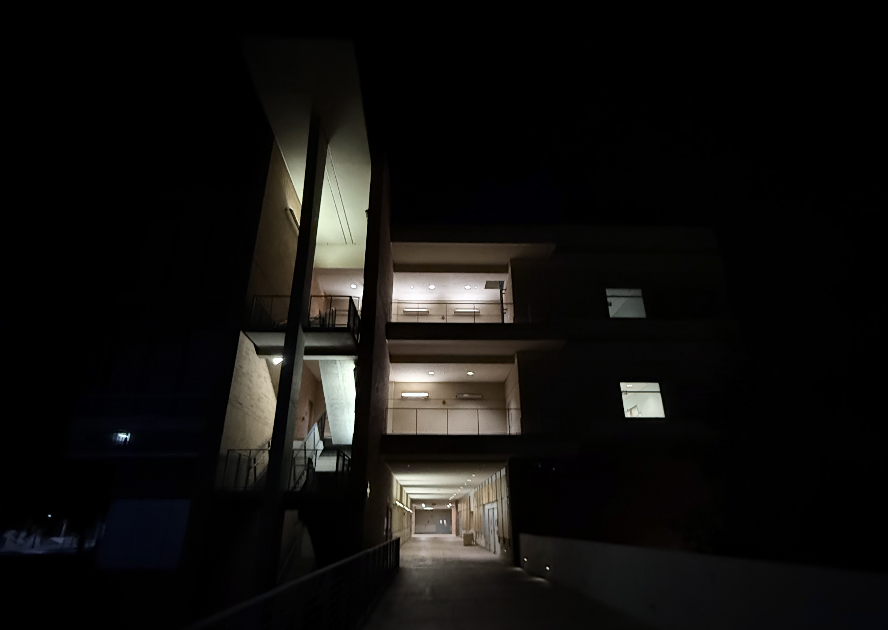

I am a fifth-year student and research assistant at University of California, Riverside, pursuing a bachelors in Physics. My laboratory experience consists of both team-based and independent research projects in experimental condensed matter physics during my time in university, as well as microbiology prior.

With additional internship, lab, and industry experiences, I hope to continue in the field of condensed matter physics, materials science & engineering, or a related area of study. You can find my CV [**here**](assets/files/Vanessa_Kwong_CV.pdf).

## Education

#### University of California, Riverside
**B.S. Physics**, Expected April 2025

My first three years in university was spent towards a degree in biology on a pre-medicine route. By the beginning of my fourth year, I had found even greater interest in being on the forefront of research and studying these processes and interactions at an atomic level. Through initially declaring a minor in physics, I explored specific fields of physics through various upper-division courses and research, eventually switching to the major.

## Research Experience and Interests

In my final years of my undergraduate degree, I have been working as an undergraduate researcher in experimental condensed matter at [**The Joe Lab**](https://joelab.ucr.edu/), focusing on transport and optical properties of two-dimensional materials within heterostructure devices.

Through extensive laboratory and research experience, I have become an adaptable and dedicated researcher, especially driven by my fascination and curiosity to understand and expand the novelty in science behind modern technological advancements.

Having pivoted from an academic and research background in biological sciences, I have a profound interest in multidisciplinary research and a desire to help in overcoming conventionally steep learning curves.
