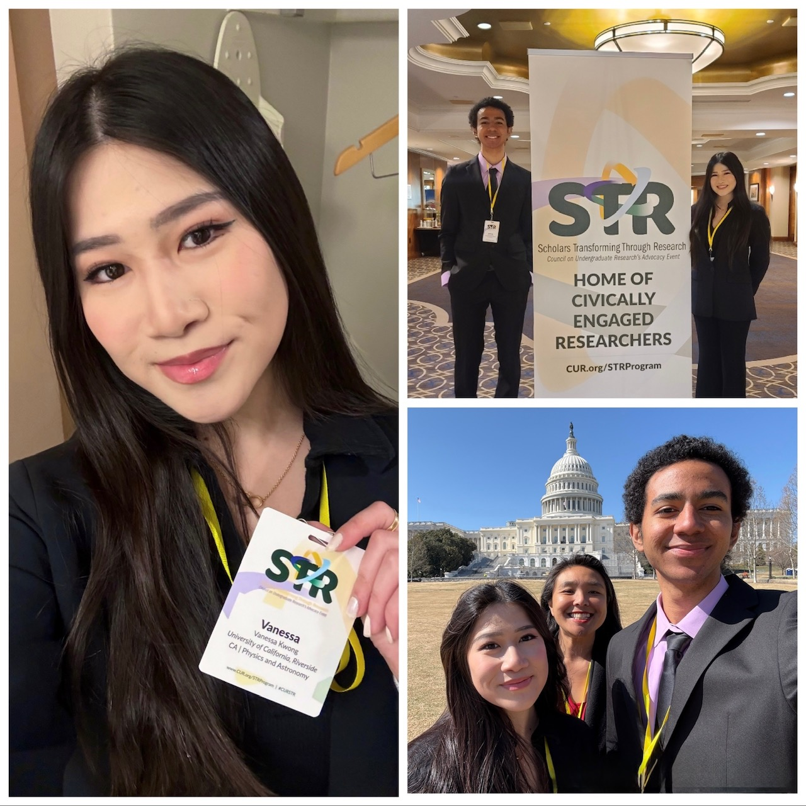

## Council for Undergraduate Research: STR Program
*March 1, 2025 - March 3, 2025*

- Represent University of California, Riverside, and the UC system in sharing impact of past undergraduate research experience 

- Advocate for undergraduate research funding to stakeholders and funding sources at Capitol Hill, including California Sen. Alex Padilla, Sen. Adam Schiff, and Rep. Mark Takano, emphasizing importance in mentorship, early exposure to opportunities in academia, and nurturing the next generation of researchers and their applied work

- Participate in multiple workshops to enhance development and advocacy in scientific communication

More information on the CUR-STR program can be found [**here**](https://www.cur.org/events-services/str-program/).

The featured articles can be found here:

 [UCR Team to Participate in National Undergraduate Research Program](https://insideucr.ucr.edu/awards/2024/10/16/ucr-team-participate-national-undergraduate-research-program).

 [CNAS Visits Washington...](https://cnas.ucr.edu/news/2025/03/20/cnas-visits-washington-call-action)

---
## 2024 UC Riverside Research in Science & Engineering Symposium
*Aug. 28, 2024*

My oral presentation slides on my summer project, **"Developing Low Temperature Contacts for Monolayer TMD Heterostructures"**, can be found [**here**](assets/files/Vanessa-Kwong-RISE-Oral-Presentation.pdf).

More information on the symposium can be found [**here**](https://rise.ucr.edu/2024-risemarc-symposium).

---

## 2024 UC Riverside Undergraduate Research and Creative Activities Symposium
*Apr. 2024*

My oral presentation, **"Optical Characterization of TMD Heterostructure Devices"**, can be found [**here**](https://www.youtube.com/watch?v=1-5c_JY-Y90).

Silicon-based semiconductor devices have come to make many modern technological advances including transistors and photodetectors. Two-dimensional (2D) van der Waals materials are of interest for fabricating even smaller devices because they can be mechanically exfoliated to the atomically-thin limit. One class of such materials, monolayer semiconducting transition metal dichalcogenides (TMDs), are of particular interest for optoelectronic device applications due to their direct band gap. Due to their spin-valley locking, TMDs can make use of the additional valley degree of freedom.

We create and optically characterize the electrically controllable WSe₂ and MoSe₂ monolayer transistor devices at room and cryogenic temperatures. These devices will serve as the basis for designing novel valleytronic devices, where photons can be stored and manipulated in both the spin and valley states.

More information on the symposium can be found [**here**](https://engage.ucr.edu/research/symposium).
