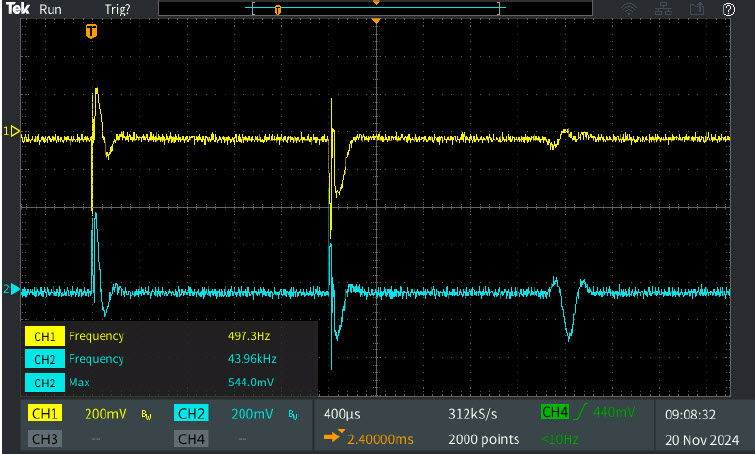
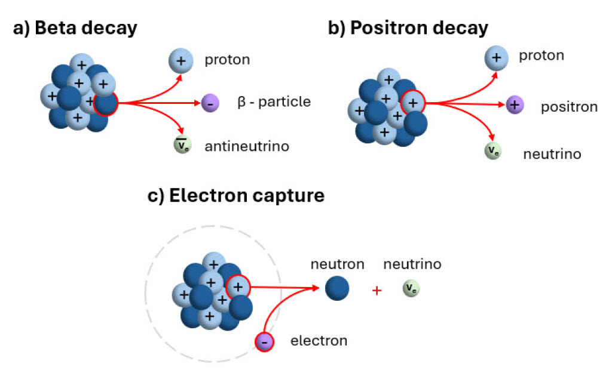
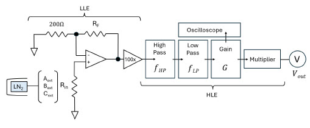
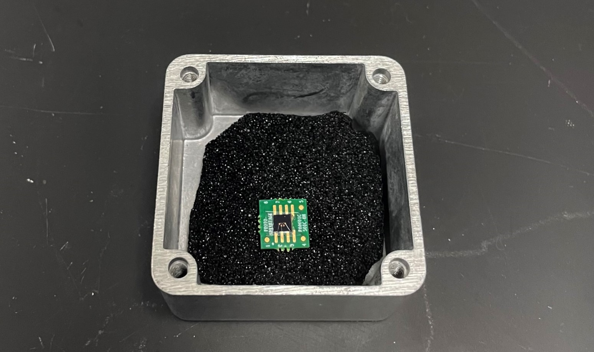
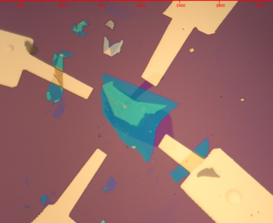
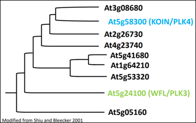

*My laboratory experience consists of both team-based and independent research projects in experimental condensed matter physics during my time in university, as well as microbiology prior.*

---
## Pulsed Nuclear Magnetic Resonance
*Nov. 2024 - Dec. 2024*

This project was finished in fulfillment for the capstone laboratory course , **PHYS 142W**, at UC Riverside.

Pulsed nuclear magnetic resonance (PNMR) is a method used to determine the magnetic moment of nuclei, finding their distinct energy levels based on their nucleus spin and splitting. Deriving from the original nuclear magnetic resonance method, PNMR implements oscillating eleectromagnetic fields as short pulses of radio frequency signals.

In this experiment, we measue resonant frequencies with PNMR. Each of the tested liquid samples—water, glycerin, and two concentrations of Fe3+ ionized solutions—contains protons in the nuclei which are measured for their collective resonant adsorption, determined by the finel tuned resonant condition. This is done through observation of the free induction decay, or FID, telling the different relaxations of the spin-spin relaxation (T1) and spin-lattice relaxation (T2)—which we can use to calculate magnetic moments of the nuclei.

My final report can be found [**here**](assets/files/Pulsed_Nuclear_Magnetic_Resonance.pdf).

---

## Gamma Ray Emission From Radioactive Isobars
*Nov. 2024*

This project was finished in fulfillment for the capstone laboratory course , **PHYS 142W**, at UC Riverside.

Three types of decay—beta (β) decay, positron decay, and electron capture—are studied through collection of gamma-ray energy spectra of five different radioactive materials. 

My final report can be found [**here**](assets/files/Gamma_Ray_Emission_from_Radioactive_Isobars.pdf).

---

## Noise Fundamentals
*Oct. 2024 - Nov. 2024*

This project was finished in fulfillment for the capstone laboratory course , **PHYS 142W**, at UC Riverside.

In the process of data collection and experimentation, there is often interference or an unwanted signal that affects the collected numerical or observational results, defined as noise. Here, we examine two types of common noise: Johnson noise, which is caused by thermal interference in electron flux during flow, and Shot noise, which is caused by a difference in electrical charge.

My final report can be found [**here**](assets/files/Noise_Fundamentals.pdf).

---

## Developing Low Temperature Contacts in TMD Heterostructure Devices
*Jun. 2024 - Aug. 2024*

This project was completed for the UC Riverside [**Research in Science and Engineering (RISE) Program**](https://rise.ucr.edu/).

Studies of two-dimensional (2D) Van der Waals (VdW) heterostructure devices have contributed significantly to novel optoelectronics advancements and correlated quantum states at the atomic scale. WSe₂, a semiconducting transition metal dichalcogenide (TMD), has a direct bandgap when reduced to a monolayer, and can be used for both optical and electrical measurements. However, a lack of reliable, low resistance electrical contacts to semiconducting 2D materials has hindered careful electron transport studies and further development of optoelectronic devices.

Here, we aim to develop reliable, Ohmic contacts by using pre-patterned platinum contacts for p-type WSe₂ monolayers.

The development of low temperature contacts will open up the possibility to measure Quantum Hall states with observable Shubnikov-de Haas (SdH) oscillations and other quantum structures such as electrically controlled quantum dots and correlated states in TMD twisted heterostructures. Going forward, we will try to develop contacts for other TMD materials to expand the available 2D materials for electronic studies and the development of efficient, silicon-based devices among modern electronics.

My final report can be found [**here**](assets/files/Vanessa_Kwong_RISE_Final_Paper.pdf) and oral presentation slides [**here**](assets/files/Vanessa-Kwong-RISE-Oral-Presentation.pdf).

---

## Optical Characterization of TMD Heterostructure Devices
*Nov. 2023 - Apr. 2024*

This project was completed for presentation at the [**UC Riverside Undergraduate Research and Creative Activities Symposium**](https://engage.ucr.edu/research/symposium).

Silicon-based semiconductor devices have come to make many modern technological advances including transistors and photodetectors. Two-dimensional (2D) van der Waals materials are of interest for fabricating even smaller devices because they can be mechanically exfoliated to the atomically-thin limit. One class of such materials, monolayer semiconducting transition metal dichalcogenides (TMDs), are of particular interest for optoelectronic device applications due to their direct band gap. Due to their spin-valley locking, TMDs can make use of the additional valley degree of freedom.

We create and optically characterize the electrically controllable WSe₂ and MoSe₂ monolayer transistor devices at room and cryogenic temperatures. These devices will serve as the basis for designing novel valleytronic devices, where photons can be stored and manipulated in both the spin and valley states.

My oral presentation can be found [**here**](https://www.youtube.com/watch?v=1-5c_JY-Y90).

---

## Mutating AT3G08680 Using CRISPR-Cas9 to Determine Functional Redundancy
*Jan. 2021 - Mar. 2021*

This project was completed as a final project for [**Dynamic Genome**](https://dynamicgenome.ucr.edu/), a research-based laboratory for a class alternative at UC Riverside.

The objective of this research project is to mutagenize and “knock-out” various genes related to WFL and KOIN to determine if there is redundancy in functionality. The comparison of A. thaliana phenotypes between ones with mutated and wild genetic sequences will determine whether each gene covers the same function as and WFL and KOIN.

My final report can be found [**here**](assets/files/Vanessa_Kwong_DG_paper.pdf) and my presentation slides [**here**](assets/files/Vanessa_Kwong_DG_ppt.pdf).

---

## Bacterial Analysis and Effectiveness of Common Natural Preservatives
*Jan. 2020 - May. 2020*

This project was completed as a capstone reearch for the [**PLTW Biomedical Sciences Pathway**](https://www.pltw.org/curriculum/biomedical-science) at [**Glen A. Wilson High School**](https://wihs.hlpschools.org/).

Bacterial counts, spectrophotometry of serial dilutions, and data analyses are done on food items, comparing to use of several natural preservatives: honey, sugar, and salt in preventing bacterial growth over time.

---

## Bacterial Analysis and Effectivelness of Common Glove Materials
*Oct. 2017 - Apr. 2018*

This project was completed for an evaluation of 3rd place Senior Microbiology Research Award at the **2018 Los Angeles County Science and Engineering Fair**,in representation of [**Glen A. Wilson High School**](https://wihs.hlpschools.org/).

Bacterial counts, spectrophotometry of serial dilutions, and data analyses are done for glove materials latex, nitrile, and vinyl to determine their effectiveness in preventing bacterial penetration in everyday use.
